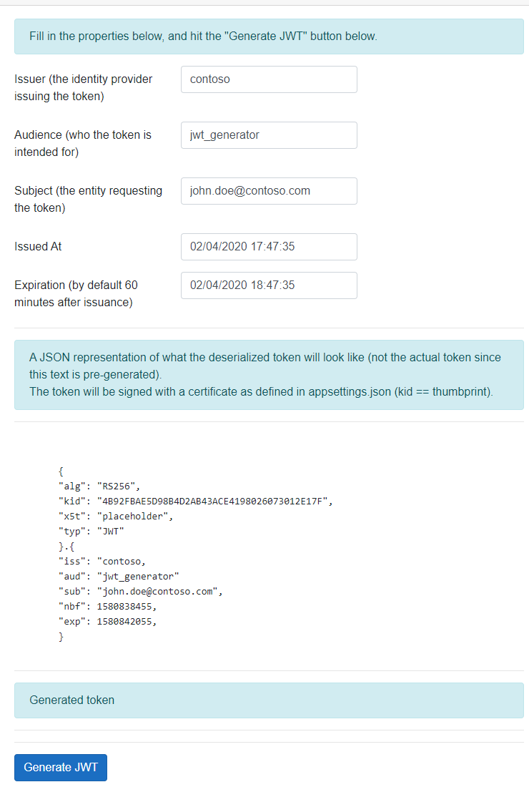

## blazor-jwt_generator-dotnet-core
### Build Status:  
[](https://batprojects.visualstudio.com/IdentitySamples/_build/latest?definitionId=26)

A ready-made Docker image can be found at:  
[https://hub.docker.com/r/ahelland/blazor-jwt_generator-dotnet-core-linux](https://hub.docker.com/r/ahelland/blazor-jwt_generator-dotnet-core-linux)

This is a web app that generates proper JSON Web Tokens valid for testing purposes. (Since there is no authentication here you could say there is a substantial piece missing for actual security.) The token is generated using values input by the user (preseeded defaults supplied) and signed with a certificate.

The app has templates for Azure AD and Azure AD B2C tokens in addition to a generic token not specific to any identity provider.



For validation purposes the app also exposes an OpenID Connect metadata endpoint at https://fqdn/.well-known/openid-configuration and a corresponding keys endpoint at https://fqdn/.well-known/keys.

The app runs on both Windows and Linux (and Docker-based variants of these), but since certificate handling is different between the two platforms the code branches based on setting the _HostEnvironment_ variable to "Windows" or "Linux".

#### Windows  
For Windows it is assumed that the certificate is stored in the current user's certificate store.

To generate (and store) a certificate use the following PowerShell commands: 
``` 
$cert = New-SelfSignedCertificate -Type Custom -Subject "CN=MySelfSignedCertificate" -TextExtension @("2.5.29.37={text}1.3.6.1.5.5.7.3.3") -KeyUsage DigitalSignature -KeyAlgorithm RSA -KeyLength 2048 -NotAfter (Get-Date).AddYears(2) -CertStoreLocation "Cert:\CurrentUser\My"  

$cert.Thumbprint
```

#### Linux  
For Linux it is assumed that the certificate is stored in _/var/ssl/private/{SigningCertThumbprint}.p12_  
Technically it can be stored in any path you like, but this ensures compatibility with deploying to Azure App Service and having the certificate stored in Azure Key Vault.

To generate a compatible certificate and retrieve the thumbprint run the following (tested on Ubuntu 18.04 on WSL):
```
openssl req -x509 -newkey rsa:4096 -keyout myKey.pem -out cert.pem -days 365 -nodes

openssl pkcs12 -export -out keyStore.p12 -inkey myKey.pem -in cert.pem

openssl x509 -in cert.pem -noout -fingerprint
```

For both operating systems set the thumbprint in the _SigningCertThumbprint_ setting in ._appsettings.json_

For more info on certificates:  
[Use Key Vault references for App Service and Azure Functions](https://docs.microsoft.com/en-us/azure/app-service/app-service-key-vault-references)
[Use an SSL certificate in your code in Azure App Service](https://docs.microsoft.com/en-us/azure/app-service/configure-ssl-certificate-in-code)